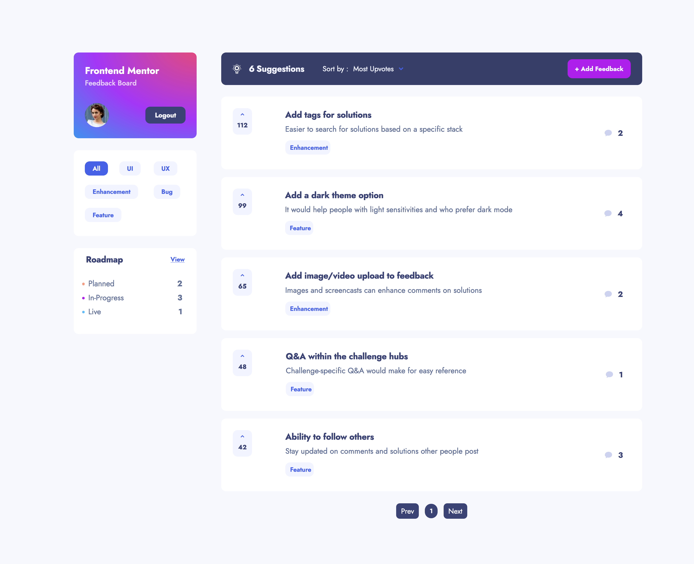

# Frontend Mentor - Product feedback app solution

This is a solution to the [Product feedback app challenge on Frontend Mentor](https://www.frontendmentor.io/challenges/product-feedback-app-wbvUYqjR6).

## Table of contents

- [Overview](#overview)
  - [The challenge](#the-challenge)
  - [Screenshot](#screenshot)
  - [Links](#links)
- [My process](#my-process)
  - [Built with](#built-with)
- [Author](#author)

## Overview

### The challenge

Users should be able to:

- View the optimal layout for the app depending on their device's screen size
- See hover states for all interactive elements on the page
- Create, read, update, and delete product feedback requests
- Receive form validations when trying to create/edit feedback requests
- Sort suggestions by most/least upvotes and most/least comments
- Filter suggestions by category
- Add comments and replies to a product feedback request
- Upvote product feedback requests
- Only user that created a feedback can edit or delete feedback
- Users can upload and change profile pictures, and edit profile
- Pagination
- Authentication. Users need to sign-in/register before they can leave a use the application

### Screenshot

### Links

- 🔗 [Solution URL](https://github.com/ossycode/product-feedback-app)
- 🔗[Live Site URL](https://product-feedback-app-ossycode.vercel.app)

## My process

### Built with

- Semantic HTML5 markup
- Tailwind CSS
- Mobile-first workflow
- [React](https://reactjs.org/) - JS library
- [Next.js](https://nextjs.org/) - React framework
- TypeScript
- Next Auth - For authentication
- MongoDB

## Author

- Frontend Mentor - [@ossycode](https://www.frontendmentor.io/profile/ossycode)
